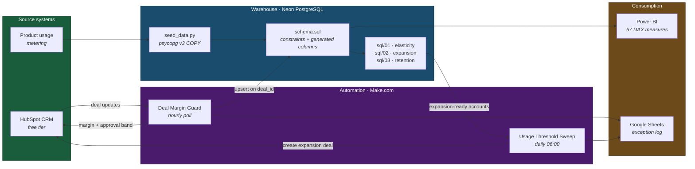
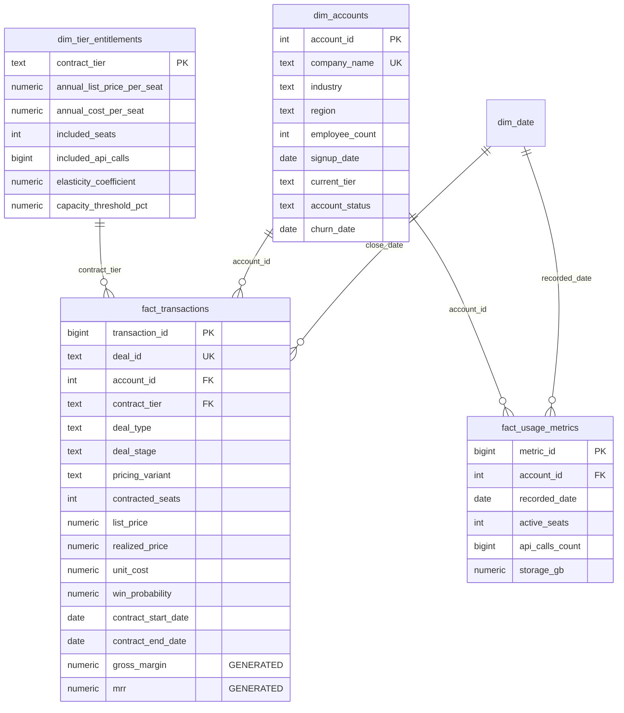

# RevYield — B2B Pricing Elasticity & Revenue Optimization Engine

[](https://www.postgresql.org/)
[](https://neon.tech/)
[](https://www.python.org/)
[](https://www.psycopg.org/psycopg3/)
[](https://powerbi.microsoft.com/)
[](https://www.make.com/)
[](LICENSE)

A commercial analytics engine for a fictional European B2B SaaS company, built end-to-end on
free-tier infrastructure. It answers one question a pricing team is actually paid to answer:

> **We want to raise prices. Which tiers can absorb it, and what does it do to gross margin?**

The repository ships the whole chain — schema, simulated-but-coherent data, SQL analytics,
automation contract, Power BI semantic layer, and this documentation.

> **The dataset is synthetic.** It is generated from an explicit demand model with a known ground
> truth, precisely so the SQL can be *graded* on whether it recovers that truth. No figure here
> describes a real company or real customers.

### 👋 New here?

**[Read `docs/how-it-works.md`](docs/how-it-works.md)** — the same project explained without jargon,
in about five minutes, including a glossary. Start there if you don't write SQL.

The short version: a software company sells three subscription packages and wants to raise prices.
Rather than guessing, it ran a real experiment — half the customers kept the old prices, half got
new ones — and then measured what actually happened to sales volume and profit. The answer turned
out to be different for each package, which is why a single company-wide number is the wrong thing
to look at.

---

## The headline

A blanket price increase across the book reads **+9.4% gross margin per opportunity**.

That number is a trap, and finding out why is the entire point of the project.

| Tier | Realized price | Contracted volume | Elasticity | 95% CI | Gross margin / opp | Verdict |
|---|---:|---:|---:|:---:|---:|:---|
| **Starter** | +7.1% | **−12.7%** | **−1.80** | [−3.11, −0.34] | €2,101 → €2,049 · **−2.4%** | 🔴 Reject |
| **Growth** | +6.9% | −5.9% | −0.86 | [−2.05, 0.44] | €8,175 → €8,480 · **+3.7%** | 🟡 Marginal |
| **Enterprise** | +12.9% | −3.9% | −0.30 | [−1.26, 0.79] | €36,765 → €41,577 · **+13.1%** | 🟢 Adopt |
| **Portfolio** | — | — | — | — | €11,834 → €12,944 · **+9.4%** | — |

**The entire portfolio gain is Enterprise.** Applying the same uplift to Starter surrenders **12.7%
of contracted volume** to move margin *backwards* by 2.4% — and that volume is the base from which
future expansion and NRR are generated. A single blended number would have hidden this completely.

**Recommendation: differentiate.** Take the full uplift on Enterprise, take Growth with tighter
discount governance, and leave Starter on the legacy card.

### An honest caveat, stated up front

With 67–132 opportunities per arm depending on tier, **only the Starter volume response is
statistically significant**. The Growth and Enterprise confidence intervals include zero — and
Enterprise, the tier carrying the strongest result, has the thinnest sample.

The *margin* verdicts stand regardless — realized price is measured precisely and margin is
observed, not inferred. But the elasticity coefficients are directional, not settled. A pricing
analyst who quotes "Enterprise elasticity is −0.30" as fact deserves the question that follows;
the correct read is "Enterprise did not detectably lose volume at +12.9%, and margin rose 13.1%."

---

## Architecture



### Data model — star schema



**Derived economics live in generated columns** — `discount_pct`, `gross_margin`,
`gross_margin_pct`, `realized_price_per_seat`, `list_price_per_seat`, `mrr`. PostgreSQL computes
them once, so ad-hoc SQL, the automation layer and Power BI cannot drift apart. This is verified by
test, not assumed.

---

## Quick start

**Nothing below needs a database or a credential.** The generator is deterministic, so the numbers
in this README reproduce exactly.

```bash
python data/seed_data.py --dry-run --summary
```

That prints the full dataset economics — including observed elasticity against the design values
the generator was built from, side by side.

Export flat files for Power BI or Google Sheets, still with no database:

```bash
python data/seed_data.py --dry-run --csv-out ./exports
```

### With a warehouse

Neon's free tier is enough. Copy `.env.example` to `.env`, paste your connection string, then:

```bash
python data/seed_data.py --apply-schema --load --summary
```

```bash
psql "$DATABASE_URL" -f sql/01_price_elasticity.sql
```

Use Neon's **direct** connection string (no `-pooler` in the hostname) for loading — the pooled
endpoint runs PgBouncer in transaction mode, which Neon itself advises against for schema
migrations. The pooled endpoint is the right choice for Power BI afterwards.

### Verify without Neon

The SQL is a work sample, so it must *run*, not just be read:

```bash
pip install pglast && python -c "import pglast,glob; [pglast.parse_sql(open(f,encoding='utf-8').read()) for f in glob.glob('sql/*.sql')]"
```

```bash
pip install pgserver && python -c "import pgserver; print(pgserver.get_server('/tmp/revyield-pg', cleanup_mode=None).get_uri())"
```

---

## What each query answers

| File | Question | Techniques |
|---|---|---|
| [`sql/01_price_elasticity.sql`](sql/01_price_elasticity.sql) | Which tiers absorbed the price rise, and what did it do to margin? | Post-stratified A/B, `GROUPING SETS`, `FILTER`, `VAR_SAMP`, delta-method CI |
| [`sql/02_tier_expansion.sql`](sql/02_tier_expansion.sql) | Which accounts have outgrown what they pay for, in what order? | `LAG`, `NTILE`, `PERCENT_RANK`, `RANK`, named `WINDOW`, running total |
| [`sql/03_cohort_retention.sql`](sql/03_cohort_retention.sql) | Does each cohort's revenue grow or decay, and why? | Monthly spine, `LAG(…,12)`, `FIRST_VALUE`, movement classification |

**Expansion pipeline:** 238 qualified accounts, **€881,640** in seat overage. The top priority band
is 25% of accounts and **84% of the money** — the readiness index is doing real work.

**Retention:** NRR **99.7%**, GRR **90.6%**, logo retention **84.0%**. The 9.1pp NRR–GRR gap *is*
the expansion story.

---

## Why the analysis is shaped the way it is

Three decisions exist because the naive version produced wrong answers.

**1 · Post-stratification is mandatory.** New-business deals are several times larger than expansion
add-ons. A chance imbalance in deal mix between the arms biases a tier-level average badly enough to
**invert the sign** of the Starter elasticity — measured at **+0.11 against a true −1.65** before
this was fixed. Strata are combined with control-arm exposure weights, in SQL and in DAX alike.

**2 · Assignment is matched-pair, not simple 50/50.** Twins share tier, cohort month and baseline
seat count, one per arm. Simple randomisation left residual noise the same size as the effect.

**3 · A falsification check is reported alongside the result.** The modelled demand response acts on
contracted volume; win rates are dealt from an exact quota identical across arms. So the win-rate gap
**must** be ~0. It comes back within ±0.7pp. A material gap would mean the pipeline is broken — not
that the price test moved win rates.

---

## Verification

Every executable artefact in this repository has been executed.

| Check | Result |
|---|---|
| Schema constraints (CHECK, UNIQUE, FK, numeric precision) | **30/30** pass |
| `sql/01` vs an independent Python estimator | **33/33** metrics identical |
| `sql/03` MRR movement identity | holds on **all 465** rows |
| Active MRR, three independent derivations | 2,921,776 · 2,921,775 · 2,921,775 |
| Automation spec (JSON, SQL, idempotency, budget) | **18** checks pass |
| DAX structural lint against live `information_schema` | **8** checks pass |
| DAX evaluated in Power BI over ADOMD | **7/7** checkpoint values match, 67 measures |
| **Neon PostgreSQL 17.10 vs local PostgreSQL 16.2** | **identical on every checked value** |

The DAX check is worth a note. There is no headless DAX engine, so the measures were run against
Power BI Desktop's own embedded Analysis Services instance over ADOMD — a live query, no UI. It paid
for itself immediately: `Active MRR` was returning €986,148 against a true €2,921,775, because
`dim_date` extends eighteen months past the end of the facts and an unsliced card was asking which
contracts were live in December 2027. Fixed with an `[As Of Date]` clamp.

The automation upsert was replayed three times and inserted exactly one row; a stale `open` replay
could not reopen a closed-won deal; and every generated column recomputed correctly on write.

---

## Repository layout

```
├── data/
│   ├── pricing_rules.json          tier economics, entitlements, experiment design
│   ├── schema.sql                  DDL — constraints, generated columns, indexes
│   └── seed_data.py                deterministic generator + psycopg v3 COPY loader
├── sql/
│   ├── 01_price_elasticity.sql     A/B evaluation, E = %ΔQ / %ΔP, margin uplift
│   ├── 02_tier_expansion.sql       Expansion Readiness Index
│   └── 03_cohort_retention.sql     MRR movement and NRR by cohort
├── automation/
│   └── make_scenario_spec.json     HubSpot → margin calc → Google Sheets + Neon
├── power_bi/
│   └── measures.dax                67 production DAX measures
├── docs/
│   ├── how-it-works.md             plain-English walkthrough + glossary
│   ├── executive_summary.md        one-page commercial briefing
│   └── interview_prep.md           pitch, resume bullets, likely questions
├── CLAUDE.md                       build and maintenance guide
└── tasks/todo.md                   build log and design decisions
```

## Stack

| Layer | Tool | Tier |
|---|---|---|
| Warehouse | Neon Serverless PostgreSQL | free |
| Ingestion | Python 3.11+ / `psycopg` v3 | — |
| Analytics | PostgreSQL 15+ SQL | — |
| Automation | Make.com + HubSpot CRM + Google Sheets | free |
| BI | Power BI Desktop | free |

Make's free tier allows 1,000 operations/month. The automation runs in **766**, and that constraint
drove every scheduling decision — the design notes in
[`automation/make_scenario_spec.json`](automation/make_scenario_spec.json) show the N+1 that had to
be removed to get there.

## Licence

[MIT](LICENSE) · Built by **Jernej Surc** — Revenue & Pricing Analyst, Berlin ·
[LinkedIn](https://linkedin.com/in/jernej-surc)
